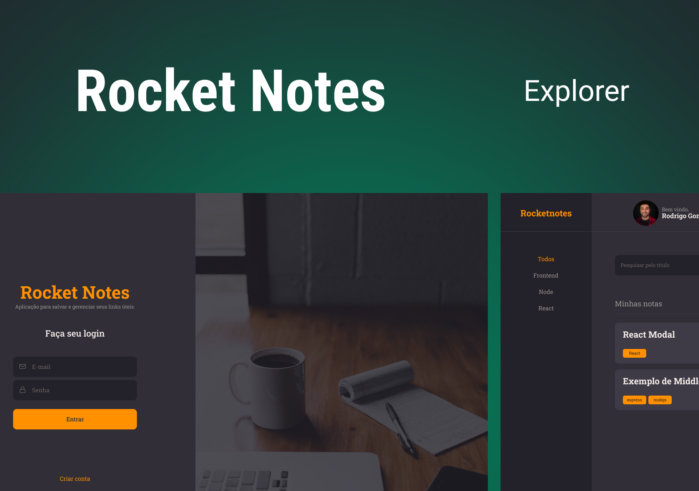

<h1 align="center">RocketNotes - FrontEnd</h1>

  <a href="#-tecnologias">Tecnologias</a>&nbsp;&nbsp;&nbsp;|&nbsp;&nbsp;&nbsp;
  <a href="#-projeto">Projeto</a>&nbsp;&nbsp;&nbsp;|&nbsp;&nbsp;&nbsp;
  <a href="#-layout">Layout</a>

  

## 🚀 Tecnologias

Esse projeto foi desenvolvido com as seguintes tecnologias:

- React
- Vite
- Styled Components
- React Router
- Git e Github

## 💻 Projeto

Este projeto foi desenvolvido em aula do Stage 09: Frontend, do curso Explorer da Rocketseat. Este Stage teve como foco a construção da interface da aplicação RocketNotes, fazendo uso de diversos conceitos de React e Styled Components, além de utilizar a biblioteca React Router para prover rotas e navegação à aplicação.

## 🔖 Layout

Você pode visualizar o layout do Figma [NESTE LINK](https://www.figma.com/file/hbBzycZDR4WGSVWyK5aOqV/RocketNotes/duplicate).
